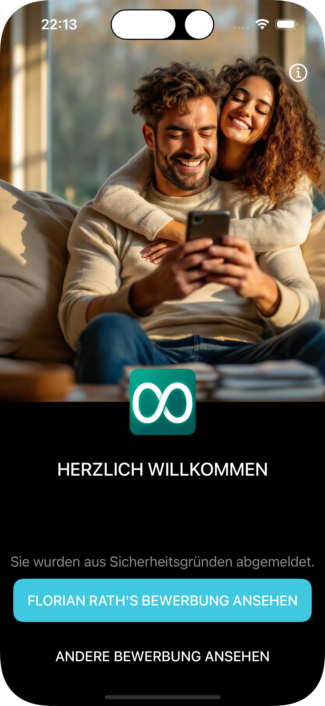
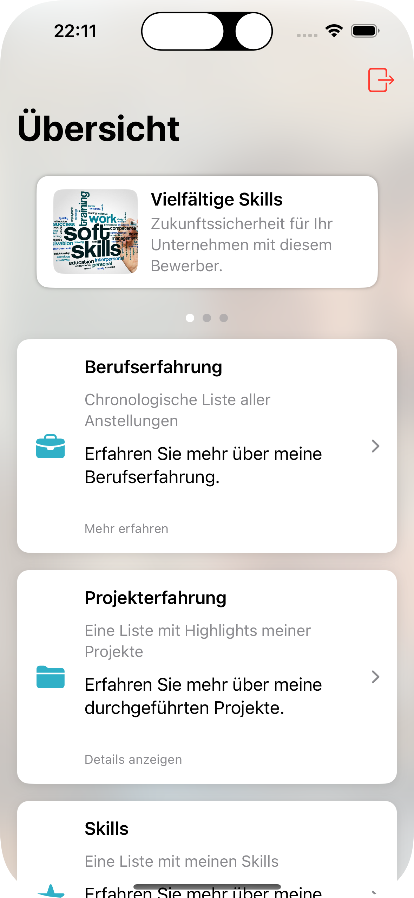
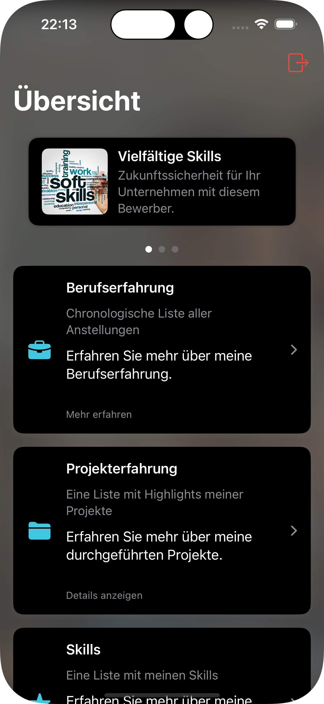
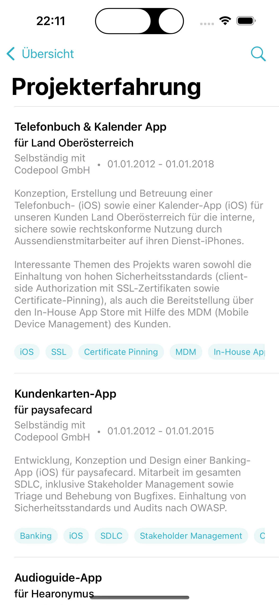
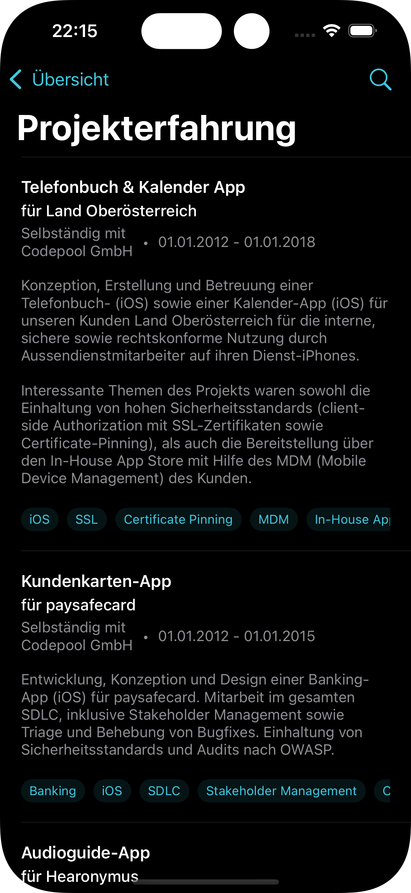
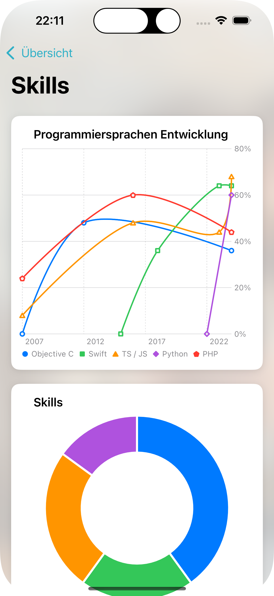
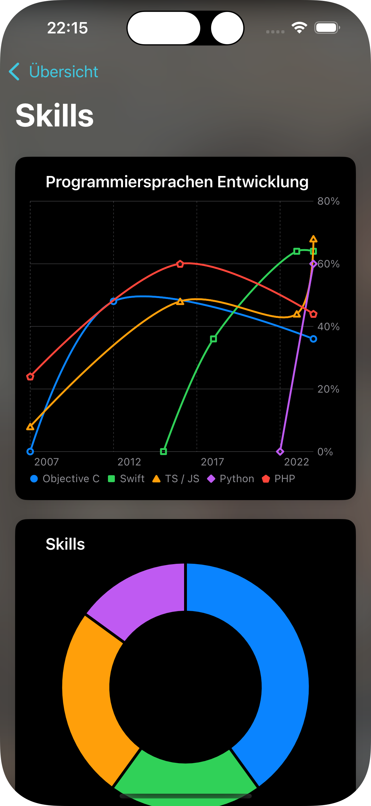
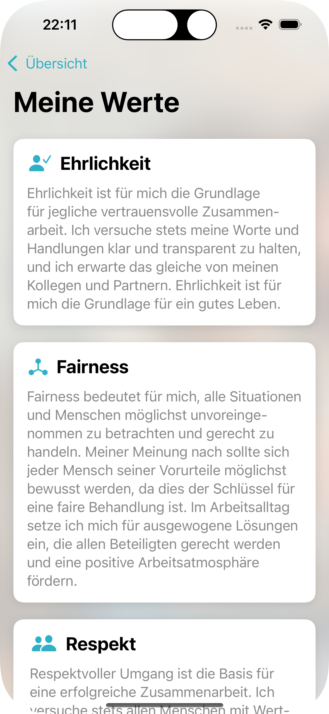
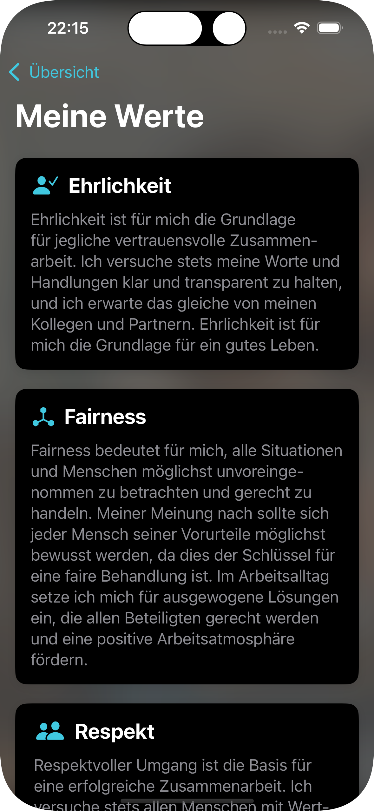

# Banking-Anwendung

Eine moderne iOS-Banking-Anwendung, entwickelt mit SwiftUI, die eine übersichtliche und benutzerfreundliche Oberfläche präsentiert.

## Warum

Dieses Projekt dient als einzigartige und interaktive Bewerbung bei einem Softwareunternehmen, das sich auf Bankanwendungen spezialisiert hat. Anstatt einen traditionellen Lebenslauf einzureichen, habe ich das Design und Konzept einer mobilen Banking-App nachgebaut, aber umfunktioniert, um mein berufliches Profil zu präsentieren.

Die App behält die vertraute Benutzeroberfläche und Navigationsmuster einer Banking-App bei, zeigt aber anstelle von Kontoinformationen:

- Meinen Lebenslauf und beruflichen Hintergrund
- Portfolio vergangener Projekte
- Technische Fähigkeiten und Expertise
- Berufliche Werte und Arbeitsphilosophie
- Persönliche Informationen

Dieser Ansatz demonstriert nicht nur meine technischen Fähigkeiten in der iOS-Entwicklung, sondern zeigt auch mein Verständnis für das Produkt, Liebe zum Detail und kreative Problemlösungsfähigkeiten. Ich möchte damit dem/der Personalverantwortlichen eine einprägsame und relevante Demonstration meiner Fähigkeiten bieten.

## Screenshots

<div style="display: flex; justify-content: space-between; margin-bottom: 40px; gap: 20px;">
    
    
</div>

<div style="display: flex; justify-content: space-between; margin-bottom: 40px; gap: 20px;">
    
    
</div>

<div style="display: flex; justify-content: space-between; margin-bottom: 40px; gap: 20px;">
    
    
</div>

<div style="display: flex; justify-content: space-between; margin-bottom: 40px; gap: 20px;">
    
    
</div>

<div style="display: flex; justify-content: space-between; margin-bottom: 40px; gap: 20px;">
    
    
</div>

## Tech Stack

- **UI Framework**: SwiftUI (mit integriertem UIKit zur Demonstration)
- **Architektur**: MVVM mit Store Pattern
- **Minimum iOS-Version**: iOS 18.0+
- **Swift-Version**: 6.0+

## Projektstruktur

```
Bank Application/
└── Sources/                  # Hauptverzeichnis des Quellcodes mit dem gesamten App-Code
    ├── App/                  # Kern-App-Features und Hauptbildschirme
    │   ├── Login/            # Authentifizierung und Login-bezogene Ansichten
    │   ├── Overview/         # Hauptdashboard und Übersichtsbildschirme
    │   ├── Values/           # Bereich für berufliche Werte und Prinzipien
    │   ├── Expertise/        # Beschäftigungshistorie und Berufserfahrung
    │   ├── Projects/         # Portfolio vergangener Projekte mit Details
    │   ├── Skills/           # Visualisierung technischer Fähigkeiten mit Diagrammen
    │   └── Personal/         # Persönliche Informationen und Hintergrund
    └── Common/               # Gemeinsam genutzte Ressourcen und Hilfsmittel
        ├── Models/           # Datenmodelle und Business-Objects
        ├── Services/         # Kerndienste wie State Management und Side-Effects
        ├── UIComponents/     # Wiederverwendbare UI-Komponenten und Ansichten
        └── Extensions/       # Erweiterungen üblicher Swift und SwiftUI Datentypen
```

## Key Components

- **AppStore**: Zentrales, app-weites State Management nach Flux-/Redux-ähnlichen Prinzipien
- **RootView**: Haupt-View-Controller zur Verwaltung des Authentifizierungszustands
- **OverviewView**: Hauptdashboard mit einer card-based UI
- **Benutzerdefinierte UI-Komponenten**: Wiederverwendbare Komponenten wie CardView, BackgroundView etc.

## Interessante Codestellen

Die Anwendung zeigt mehrere interessante architektonische und technische Ansätze:

- **State Management**: Eine saubere, von Flux/Redux inspirierte Implementierung von State Management mit einem zentralisierten [`AppStore`](Bank%20Application/Bank%20Application/Sources/Common/Services/Store/AppStore.swift), der den gesamten Anwendungszustand verwaltet. Der Store folgt einem unidirektionalen Datenfluss mit Actions, Reducer und state updates, wodurch die Zustandsänderungen der App vorhersehbar und leicht zu debuggen sind. Siehe die [Navigationserweiterung](Bank%20Application/Bank%20Application/Sources/Common/Services/Store/AppStore+OverviewView.swift) als Beispiel für die Erweiterbarkeit des Stores.

- **State Observation**: Ein [AppStateListener](Bank%20Application/Bank%20Application/Sources/Common/Services/AppStateListener.swift), der Combine verwendet, um reaktiv auf Zustandsänderungen zu reagieren, besonders nützlich für Analytics und Side-Effects.

- **Navigation State Management**: Sauberes Handling des Navigationszustands durch den [`AppStore`](Bank%20Application/Bank%20Application/Sources/Common/Services/Store/AppStore.swift):

  - Zentralisiertes Navigation State Management
  - Type-safe Navigation mittels Enums
  - Binding-basierte Navigationssteuerung
  - Automatisches State Cleanup bei Navigationsänderungen

- **Datenvisualisierung**: Umfangreiche Nutzung von Swift Charts für schöne Datenvisualisierung:

  - [`LineChart`](Bank%20Application/Bank%20Application/Sources/Common/UIComponents/SwiftUI/LineChart.swift): Wird verwendet, um die Entwicklung von Fähigkeiten über die Zeit anzuzeigen (siehe [SkillsView](Bank%20Application/Bank%20Application/Sources/App/Skills/SkillsView.swift))
  - [`PieChart`](Bank%20Application/Bank%20Application/Sources/Common/UIComponents/SwiftUI/PieChart.swift): Wird verwendet, um die Verteilung von Fähigkeiten und Expertisebereiche anzuzeigen (siehe [SkillsView](Bank%20Application/Bank%20Application/Sources/App/Skills/SkillsView.swift))

- **Erweiterte Suchfunktionalität**: Ausgefeilte Suchimplementierung in Ansichten wie [`EmploymentsView`](Bank%20Application/Bank%20Application/Sources/App/Expertise/EmploymentsView.swift) und [`ProjectsView`](Bank%20Application/Bank%20Application/Sources/App/Projects/ProjectsView.swift) mit:

  - Echtzeit-Filterung über mehrere Datenfelder
  - Groß-/Kleinschreibung-unabhängige Suche
  - Suche durch verschachtelte Datenstrukturen
  - Hervorgehobene Suchergebnisse in der Benutzeroberfläche

- **Hybrider UI-Ansatz**: Obwohl die App hauptsächlich mit SwiftUI gebaut wurde, demonstriert sie die Integration von UIKit-Komponenten wo nötig.
  Zum Beispiel zeigt der [PersonalDetailsViewController](Bank%20Application/Bank%20Application/Sources/App/Personal/PersonalDetailsViewController.swift), wie man einen
  UIKit-View-Controller in SwiftUI mittels UIViewControllerRepresentable einbindet.

## Getting Started

1. Repository klonen
2. `Bank Application.xcodeproj` in Xcode öffnen
3. Projekt erstellen und ausführen (⌘+R)

## Anforderungen

- Xcode 16.0+
- iOS 18.0+

## Design-Prinzipien

- Saubere und wartbare Codestruktur
- Moderne SwiftUI-Praktiken
- Responsive und adaptive Benutzeroberfläche
- Unterstützung von Light- und Dark-Mode
- Deutschsprachige Benutzeroberfläche
- Englische Codebasis

## Contributing

Da dies eine Beispielanwendung ist, wird keine Mitwirkung erwartet. Falls Sie dennoch beitragen möchten (aus welchem Grund auch immer), reichen Sie bitte einfach einen Pull Request ein.

## Lizenz

Dieses Projekt ist unter der MIT-Lizenz lizenziert - siehe die [LICENSE](LICENSE)-Datei für Details.

## Kontakt

Für Anfragen kontaktieren Sie bitte den Entwickler.
